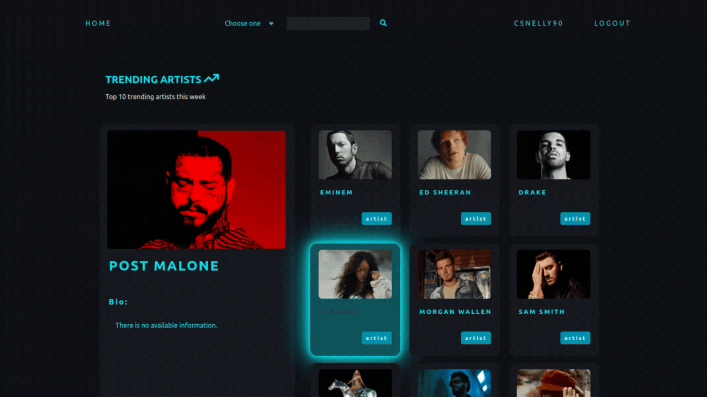

# International Music Database - (IMDb)

## Table of contents
- [Project description](#project-description)
- [Features](#features)
- [Technologies](#technologies)
- [API](#api)

## Project description

Our final, still in-progress project in the advanced module of the Codecool full-stack
course. This IMDb clone is a combination of Spotify and IMBb that helps you track
currently trending artists, albums and songs.

This is a single page application with Java, Spring Boot and Spring Security backend, React frontend and PostgreSQL.

## Features
- Login/Registration
- JWT token
- Persist user on page refresh
- Dynamic search
- Keep track of your likes on artists, albums and songs
- Play demo of the music

## Future development
- Comment on artists, albums and songs
- Change password
- Verify email
- Edit user profile
- Add avatar

## Technologies
- Java
- Spring Boot
- Spring Security
- PostgreSQL
- React
- JSX
- HTML
- CSS

## API
 In this project we are using the [Napster API](https://developer.prod.napster.com/) to fetch music related 
 information.

([Go Up](#user-content-international-music-database-imdb))
